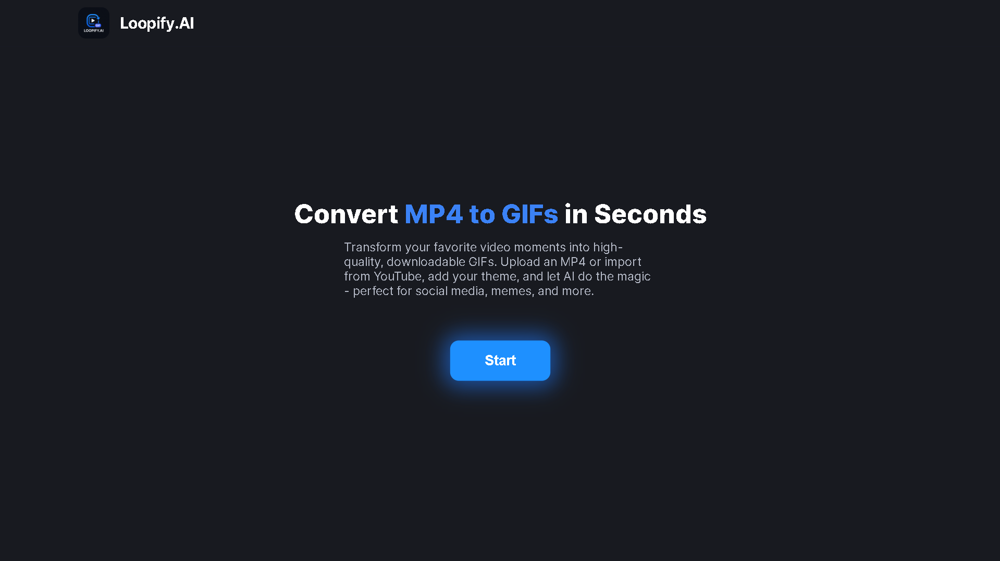

# Loopify.AI – MP4/YouTube to AI-Powered GIF Generator

Loopify.AI is a full-stack web application that lets you convert MP4 videos or YouTube clips into high-quality, captioned GIFs using AI transcription and video processing.

## Features

- 🎬 Upload MP4 videos or import from YouTube links
- 📝 Enter a theme prompt (e.g., "funny moments", "motivational clips")
- 🤖 AI extracts relevant lines from the video
- ✂️ Select a line to generate a GIF
- 🖼️ Download or preview your GIFs
- ⚡ FastAPI backend, React frontend

---

## Demo

 <!-- Add a demo GIF or screenshot if available -->

---

## Technologies used

**Frontend:**
- React
- JavaScript
- CSS

**Backend:**
- FastAPI
- Python
- MoviePy
- OpenAI Whisper
- yt-dlp
- webvtt-py

**Other:**
- Git & GitHub for version control
- Vercel for frontend deployment
- Render for backend deployment
---

## 📂 Project Structure

```
.
├── backend/           # FastAPI backend
│   ├── main.py
│   ├── utils.py
│   ├── requirements.txt
│   └── ...
├── frontend/          # React frontend
│   ├── src/
│   ├── public/
│   ├── package.json
│   └── ...
├── persist_uploads/   # Temporary uploads
├── sample_videos/     # Sample videos (optional)
├── .gitignore
├── README.md
└── ...
```

---

## Getting Started

### 1. Clone the repository

```sh
git clone https://github.com/your-username/loopify-ai.git
cd loopify-ai
```

### 2. Backend Setup (FastAPI)

```sh
cd backend
python -m venv venv
# On Windows:
venv\Scripts\activate
# On macOS/Linux:
source venv/bin/activate
pip install -r requirements.txt
uvicorn main:app --reload
```

### 3. Frontend Setup (React)

```sh
cd ../frontend
npm install
npm start
```

### 4. Usage

- Open [http://localhost:3000](http://localhost:3000) in your browser.
- Upload an MP4 file or paste a YouTube link.
- Enter a theme prompt and generate GIFs.

---

## 🧑‍💻 Contributing

Contributions are welcome! Please open an issue or submit a pull request for any improvements or bug fixes.

---

## 📄 License

This project is licensed under the [MIT License](LICENSE).

---

## 🙋‍♂️ Contact

For questions or support, please open an issue or contact [afjalshaiktechy@gmail.com](mailto:afjalshaiktechy@gmail.com).

---

## ⭐ Acknowledgements

- [FastAPI](https://fastapi.tiangolo.com/)
- [React](https://react.dev/)
- [MoviePy](https://zulko.github.io/moviepy/)
- [OpenAI Whisper](https://github.com/openai/whisper)
- [yt-dlp](https://github.com/yt-dlp/yt-dlp)
